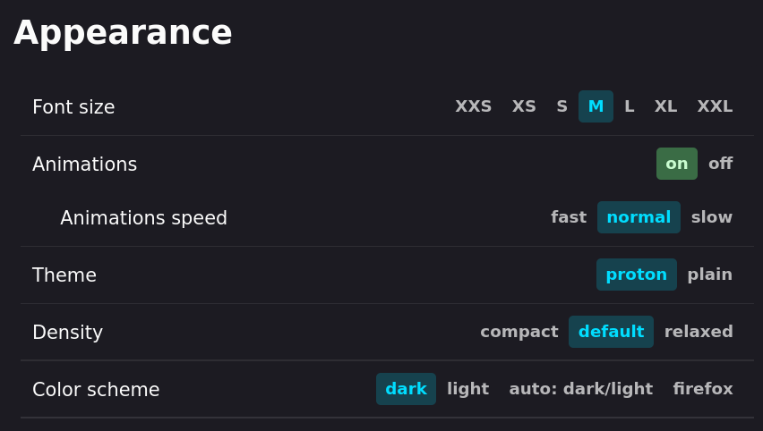

<h1 align="center">gale for Firefox</h1>

My CSS files to use with Firefox and Sidebery

My goal with these settings was to create a minimalistic yet functional setup
with Sidebery tuned to match Firefox Default Dark Theme and optimise the
workspace. If you find any odd behaviour feel free to send a pull request.

### How to install?

1. In Firefox, go to `about:config` and set `toolkit.legacyUserProfileCustomizations.stylesheets` to `True`. Make sure you have the <a href="https://www.userchrome.org/how-create-userchrome-css.html">chrome folder</a> within your Firefox profile
2. Get <a href="https://github.com/mbnuqw/sidebery/">Sidebery v5 (beta)</a> if you don't have it already installed
3. Copy `userChrome.css`, `darkTheme.css` and `private.css` to the chrome folder
4. Go to Sidebery settings and paste the content of my `sidebery.css` file into _Styles editor > Sidebar_
5. Enjoy your new setup!

Set these settings under appearance in Sidebery (optional but recommended):

### Known bugs

- Due to a bug that has been present in Firefox for quite some time already, the autoshrink functionality isn't working as intended in Sidebery beta, so I decided to disable such characteristic until I find a workaround. Related <a href="https://bugzilla.mozilla.org/show_bug.cgi?id=1818517">issue</a> (thanks <a href="https://github.com/emiham">@emiham</a> for the heads-up)
- ~~When moving a tab, the tab position indicator doesn't follow the `margin-top` CSS rule for tabs~~  **_Fixed!_**

### Credits

- to <a href="https://github.com/MrOtherGuy">@MrOtherGuy</a> for his <a href="https://github.com/MrOtherGuy/firefox-csshacks">Firefox CSS Hacks</a>
- to <a href="https://www.reddit.com/user/captainkaba/">u/captainkaba</a> for his <a href="https://www.reddit.com/r/FirefoxCSS/comments/rqo5z6/some_people_asked_for_the_css_so_here_is_my_setup/">Denkfabrik</a> theme (which I used as a base for legacy)
- to Reddit user <a href="https://www.reddit.com/user/It_Was_The_Other_Guy/">u/It_Was_The_Other_Guy</a> for his <a href="https://www.reddit.com/r/FirefoxCSS/comments/vzcqzn/comment/ig8a8ba/">tip</a> which was very useful in legacy
- to Reddit user <a href="https://www.reddit.com/user/GainghisKhan/">u/GainghisKhan</a> for <a href="https://www.reddit.com/r/FirefoxCSS/comments/wcc9fc/comment/j2aoa8r/">finding a bug and providing a solution idea for it</a> in legacy

