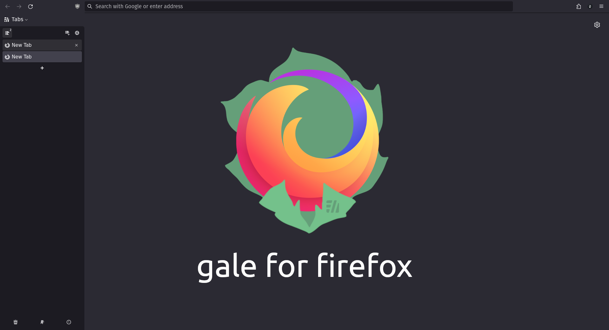

<h1 align="center">gale for Firefox</h1>

My CSS files to use with Firefox and Sidebery

My goal with these settings was to create a minimalistic yet functional setup with Sidebery tuned to match Firefox Default Dark Theme and optimise the workspace. If you find any odd behaviour feel free to send a pull request.

<h3>How to install?</h3>
<ol>
<li> In Firefox, go to <code>about:config</code> and set <code>toolkit.legacyUserProfileCustomizations.stylesheets</code> to <code>True</code></li>
<li> Make sure you have <i>userChrome.css</i> file and folder path created <a href="https://www.userchrome.org/how-create-userchrome-css.html">properly</a></li>
<li> Get <a href="https://addons.mozilla.org/firefox/addon/sidebery">Sidebery</a> if you don't have it already installed</li>
<li> Copy the content in my <i>userChrome.css</i> to your file (I don't support this method) or replace/copy it in the corresponding folder path</li>
<li> Go to Sidebery settings and paste the content of my <i>sidebery.css</i> file into <i>Styles editor > Sidebar</i> </li>
<li> Enjoy your new setup!</li>
</ol>

<h3>Known bugs</h3>
<ul>
<li>When moving a tab, the tab position indicator doesn't follow the <code>margin-top</code> CSS rule for tabs; if it bothers you a lot, identify <code>.Tab {margin-top: 5px;</code> and remove it.<b><i>&nbsp;&nbsp;Fixed!</i></b></li>
</ul>

<h3>Credits</h3>
<ul>
<li>to <a href="https://github.com/MrOtherGuy">@MrOtherGuy</a> for his <a href="https://github.com/MrOtherGuy/firefox-csshacks">Firefox CSS Hacks</a></li>
<li>to <a href="https://www.reddit.com/user/captainkaba/">u/captainkaba</a> for his <a href="https://www.reddit.com/r/FirefoxCSS/comments/rqo5z6/some_people_asked_for_the_css_so_here_is_my_setup/">Denkfabrik</a> theme (which I used as a base for this project)</li>
<li>to the Reddit user <a href="https://www.reddit.com/user/It_Was_The_Other_Guy/">u/It_Was_The_Other_Guy</a> for his <a href="https://www.reddit.com/r/FirefoxCSS/comments/vzcqzn/comment/ig8a8ba/?utm_source=share&utm_medium=web2x&context=3">tip</a></li>
</ul>
